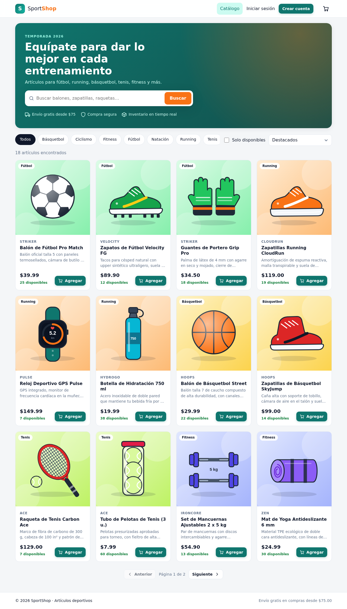
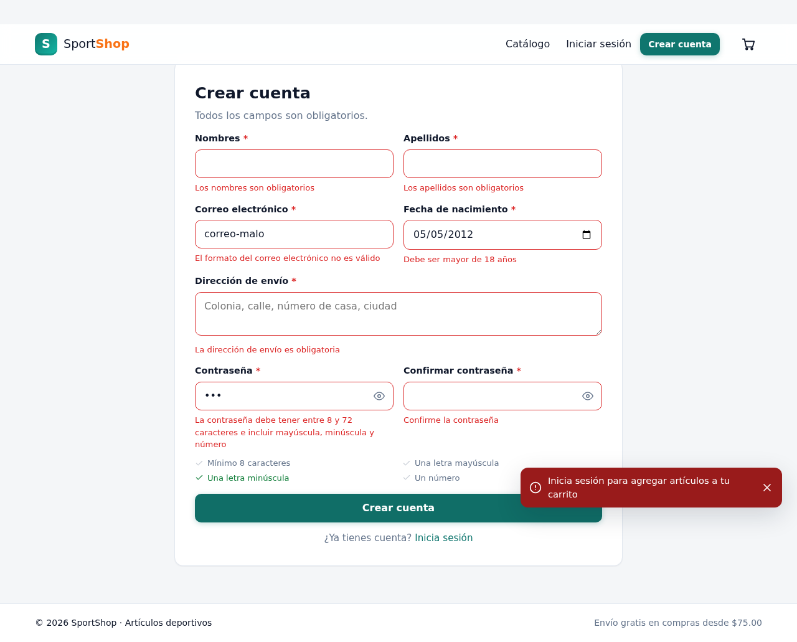
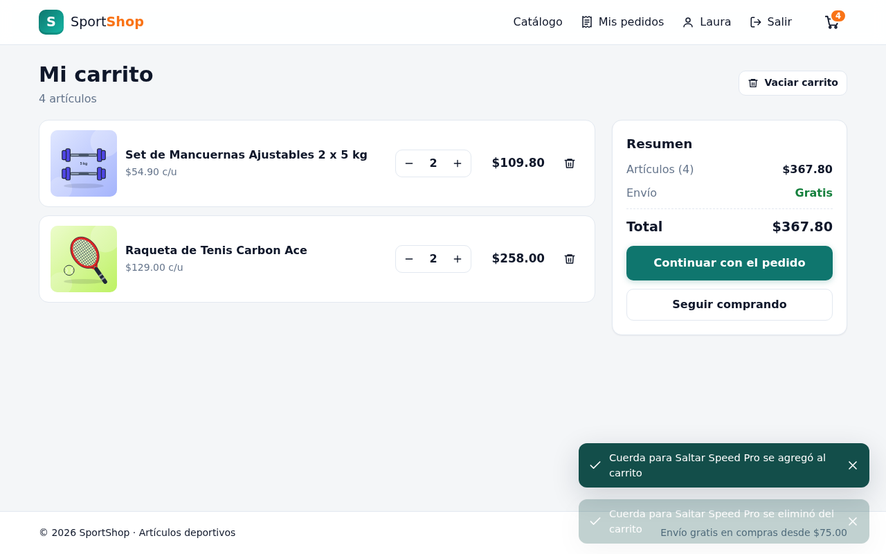
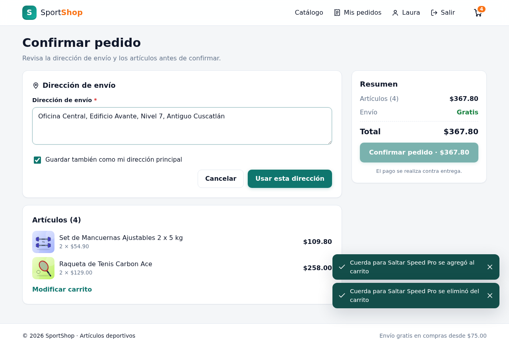
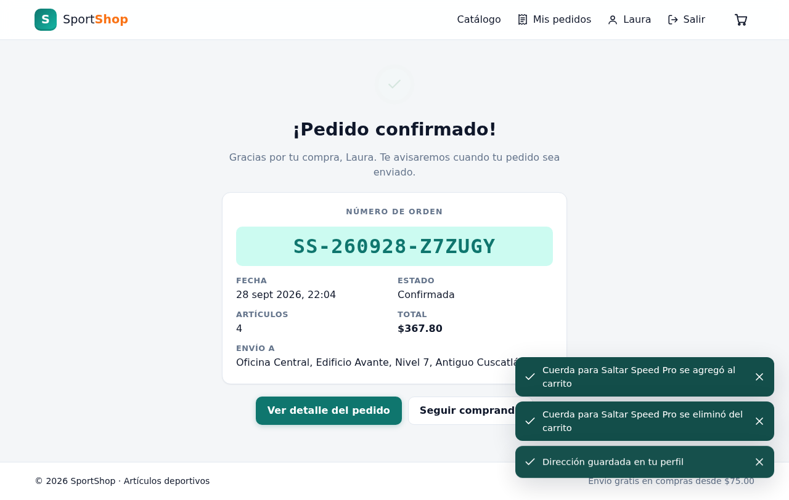
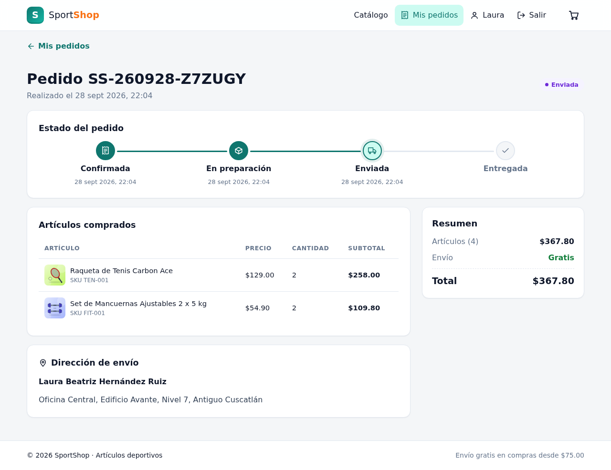
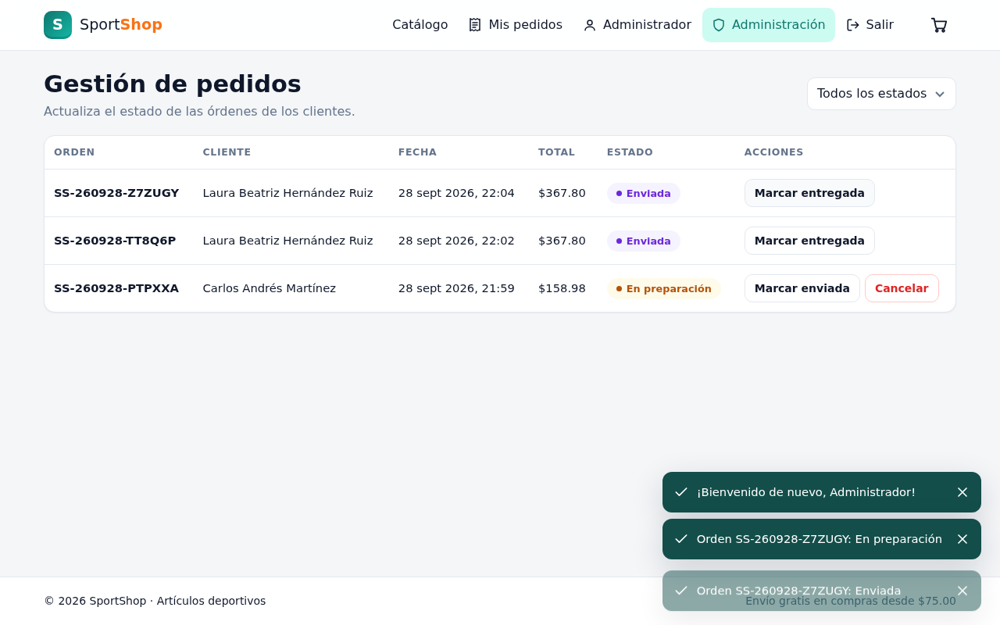
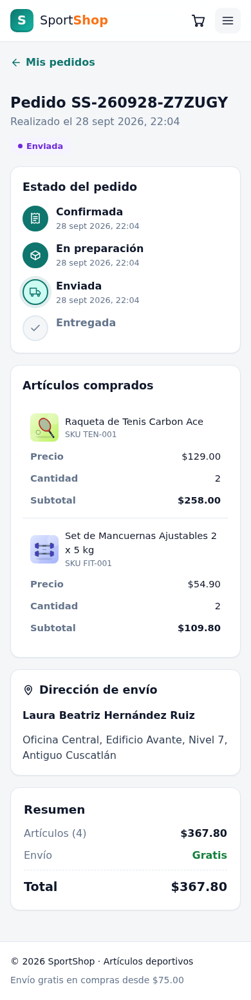
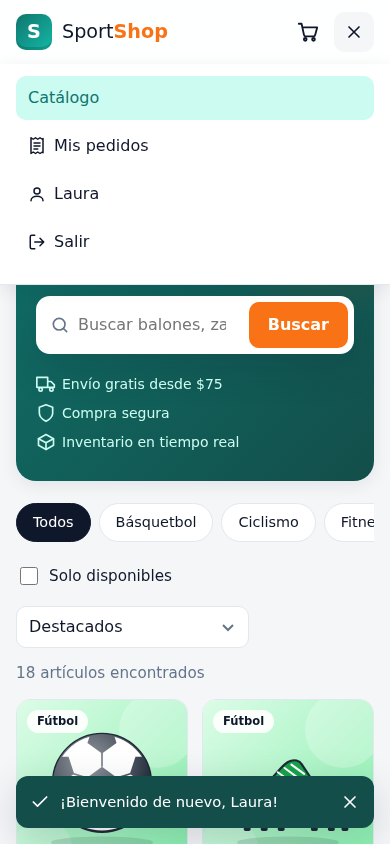

# Evaluación Técnica: Software Engineer

Solución completa de la prueba técnica. El caso práctico (**SportShop**, un carrito de compras de
artículos deportivos) está implementado con **React JS + microservicios Java Spring Boot + MariaDB
+ JWT**, y las secciones teóricas están respondidas en `docs/`.

| Sección | Contenido | Documento |
|---|---|---|
| **1. Análisis y Diseño** | Arquitectura para 30M visitas/mes (infraestructura, componentes, bases de datos y frameworks) y diseño de la API de clientes con códigos HTTP | [docs/seccion-1-analisis-diseno.md](docs/seccion-1-analisis-diseno.md) · [OpenAPI](docs/seccion-1-api-clientes.openapi.yaml) |
| **2. Caso Práctico** | Aplicación funcional (este repositorio): arquitectura, endpoints, trazabilidad de requerimientos, seguridad y pruebas | [docs/seccion-2-caso-practico.md](docs/seccion-2-caso-practico.md) |
| **3. Conocimientos** | `synchronized`, IoC, anotaciones de Spring, HTML5, `var`/`let`/`const`, JSX, regex, métodos HTTP, `async`, event loop, bases de datos en contenedores, OWASP | [docs/seccion-3-conocimientos.md](docs/seccion-3-conocimientos.md) |
| **4. Frameworks** | Controlador `/greeting` en Spring Boot y Dockerfile de nginx (código ejecutable en [`seccion-4/`](seccion-4)) | [docs/seccion-4-frameworks.md](docs/seccion-4-frameworks.md) |
| **5. Gestión de Proyectos** | Inicio del Sprint, roles de Scrum, SPI del PMBOK | [docs/seccion-5-gestion-proyectos.md](docs/seccion-5-gestion-proyectos.md) |



---

## Ejecutar con Docker (recomendado)

Requisitos: Docker 24+ con Docker Compose v2.

```bash
docker compose up --build
```

La primera vez tarda unos minutos (descarga imágenes y compila). Cuando todos los servicios estén
*healthy*:

| URL | Qué es |
|---|---|
| **http://localhost:8080** | Aplicación (React + API Gateway nginx) |
| http://localhost:8025 | Mailpit: bandeja donde llegan los correos de recuperación de contraseña |
| http://localhost:8081/swagger-ui.html | Swagger de user-service |
| http://localhost:8082/swagger-ui.html | Swagger de catalog-service |
| http://localhost:8083/swagger-ui.html | Swagger de order-service |

**Cuentas de demostración** (también se puede crear una cuenta nueva desde "Crear cuenta"):

| Rol | Correo | Contraseña |
|---|---|---|
| Cliente | `cliente@sportshop.com` | `Demo1234` |
| Administrador (gestiona estados de pedidos) | `admin@sportshop.com` | `Demo1234` |

Para producción, copiar `.env.example` a `.env` y definir secretos propios (`JWT_SECRET`,
`INTERNAL_API_KEY` y contraseñas de la base de datos). Para detener todo: `docker compose down`
(con `-v` también se borra la base de datos).

## Ejecutar en modo desarrollo (sin contenedores para las apps)

Requisitos: Java 21, Node.js 22+ y Docker (solo para MariaDB y Mailpit).

```bash
# 1) Base de datos y correo
docker compose up -d mariadb mailpit

# 2) Microservicios (una terminal para cada uno)
cd backend
./mvnw -pl common install -DskipTests
MAIL_ENABLED=true ./mvnw -pl user-service spring-boot:run   # :8081
./mvnw -pl catalog-service spring-boot:run                  # :8082
./mvnw -pl order-service spring-boot:run                    # :8083

# 3) Frontend (Vite enruta /api/* a cada microservicio)
cd frontend
npm install
VITE_MAILPIT_URL=http://localhost:8025 npm run dev          # http://localhost:5173
```

Los valores por defecto de `application.yml` coinciden con los de `docker-compose.yml`, así que no
hace falta configurar nada más para desarrollo local.

## Pruebas

```bash
cd backend && ./mvnw verify                 # 32 pruebas (JUnit 5 + MockMvc + H2 en modo MariaDB)
cd frontend && npm test                     # 22 pruebas (Vitest + Testing Library)
cd seccion-4/greeting-api && mvn test       # 3 pruebas del controlador /greeting
```

## Guion sugerido para la demo

1. **Catálogo anónimo:** buscar "zapatillas", filtrar por categoría, activar "Solo disponibles"
   (el kettlebell está agotado) y ordenar por precio.
2. Intentar **Agregar** sin sesión: la app redirige al login.
3. **Registro:** enviar el formulario vacío, luego con un correo inválido y una fecha de menor de
   edad, y ver las validaciones. Después completarlo correctamente.
4. **Carrito:** agregar artículos, cambiar cantidades (el envío es gratis desde $75), eliminar un
   artículo.
5. **Checkout:** revisar la dirección, pulsar **Editar**, cambiarla (con la opción de guardarla en
   el perfil) y **Confirmar pedido**: aparece el número de orden.
6. **Mis pedidos:** detalle con artículos, montos y línea de tiempo del estado.
7. En otra ventana, entrar como **admin**, ir a **Administración** y avanzar el pedido a
   "En preparación" y "Enviada". El cliente ve el nuevo estado.
8. **Perfil:** editar datos y cambiar la contraseña.
9. **Recuperar contraseña:** solicitar el enlace, abrir **Mailpit** (http://localhost:8025),
   seguir el enlace y definir una nueva contraseña.
10. Mostrar la vista **móvil** (DevTools, 390 px) y la estructura del código (ver
    [docs/seccion-2-caso-practico.md §7](docs/seccion-2-caso-practico.md#7-estructura-del-código)).

## Estructura del repositorio

```
├── backend/            # Microservicios Spring Boot (common, user-service, catalog-service, order-service)
├── frontend/           # React JS (Vite) + configuración nginx del API Gateway
├── database/init/      # Esquemas y usuarios de MariaDB por servicio
├── docker-compose.yml  # Entorno completo
├── docs/               # Respuestas de las secciones 1 a 5 y capturas de pantalla
└── seccion-4/          # Código ejecutable de la sección 4
```

## Entrega en GitLab

El enunciado pide subir el código a un repositorio **público de GitLab** en una rama
`APP-{Nombre}`. Desde una copia local de este repositorio:

```bash
# 1) Crear en GitLab un proyecto público vacío (sin README) y copiar su URL
git remote add gitlab https://gitlab.com/<usuario>/<proyecto>.git

# 2) Crear la rama con el nombre requerido (reemplazar Nombre) y subirla
git checkout -b APP-Nombre
git push -u gitlab APP-Nombre
```

## Capturas

| | |
|---|---|
|  |  |
|  |  |
|  |  |
|  |  |
