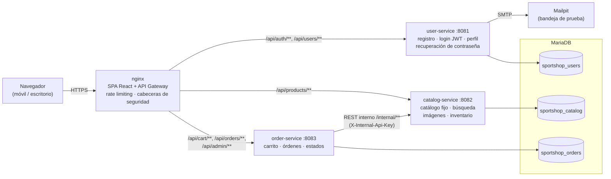
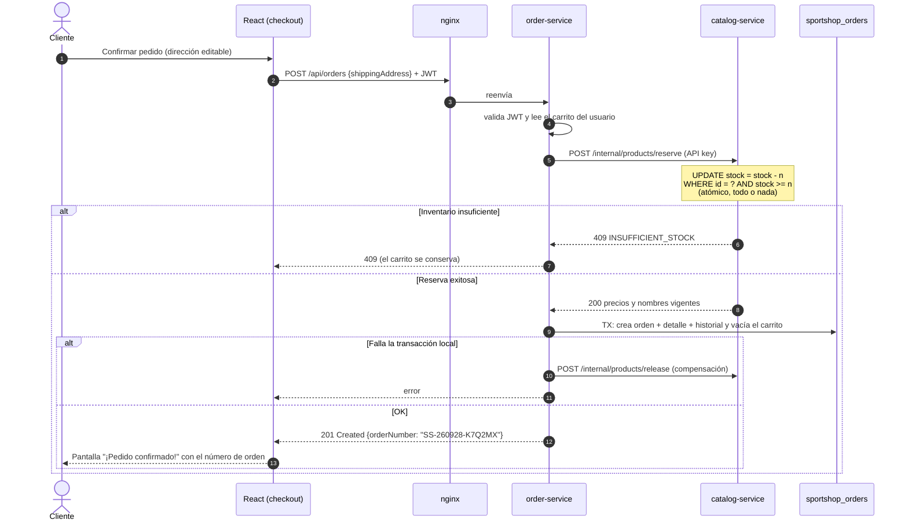
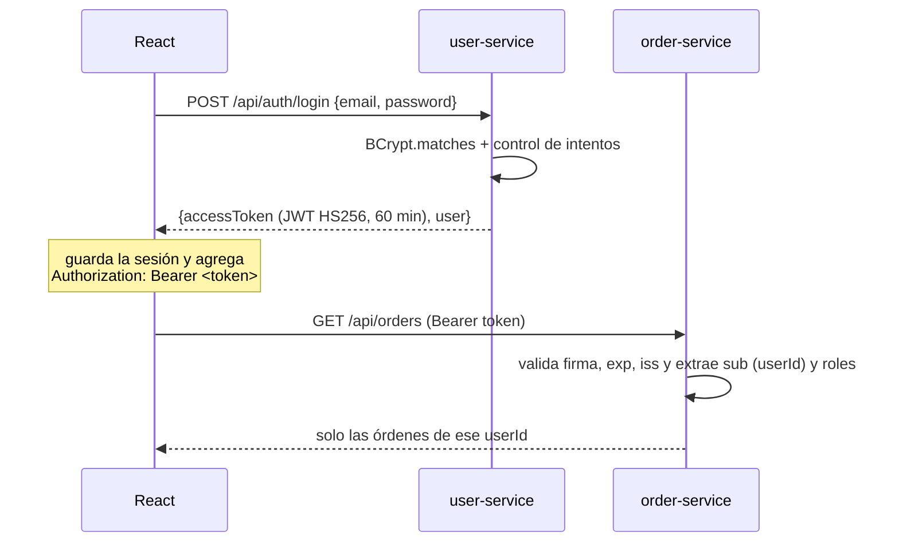
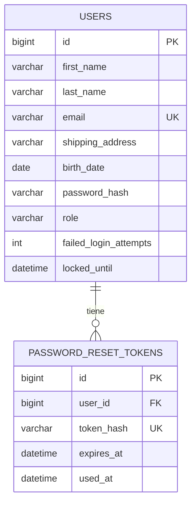
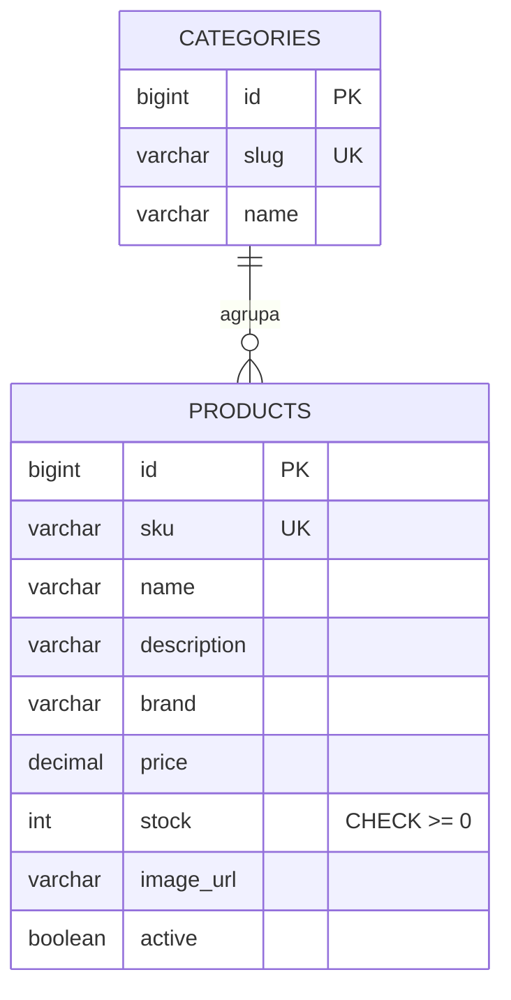
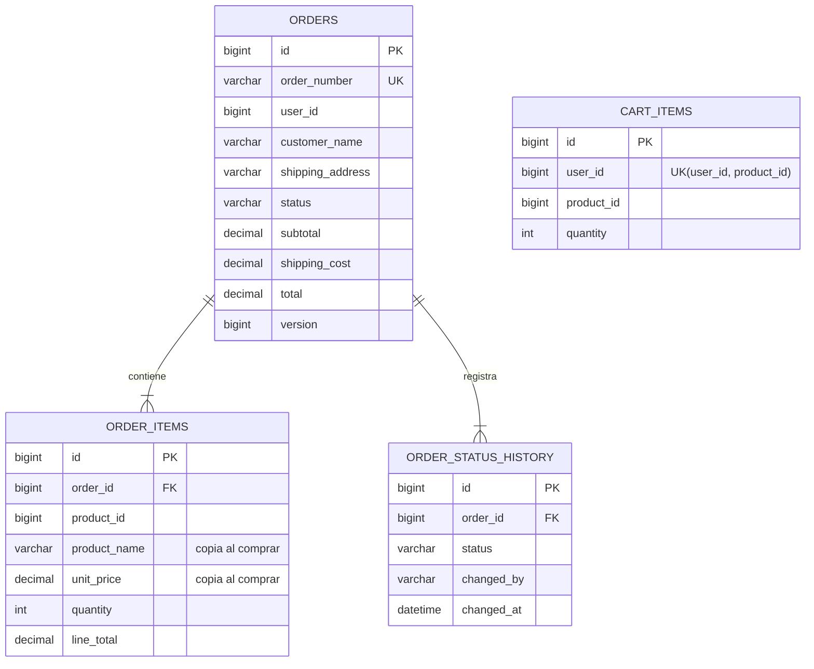

# Sección 2: Caso práctico. Carrito de compras de artículos deportivos

**SportShop** es una aplicación *responsive* para comprar artículos deportivos, construida con
**React JS** en el frontend, **microservicios Java Spring Boot** en el backend, **MariaDB** como
base de datos y autenticación con **JWT**.

| Capa | Tecnología |
|---|---|
| Frontend | React 19 (JavaScript) + React Router 7 + Vite 8, CSS propio *mobile first* |
| Backend | Java 21, Spring Boot 4.1 (Web MVC, Security OAuth2 Resource Server, Data JPA, Validation, Mail, Actuator), springdoc-openapi |
| Base de datos | MariaDB 11.4 (un esquema por microservicio) con migraciones **Flyway** |
| Seguridad | JWT HS256 emitido por user-service y validado por cada servicio; BCrypt; API key interna |
| Infraestructura | Docker, docker-compose, nginx (API Gateway y estáticos), Mailpit (correo de prueba) |
| Pruebas | JUnit 5 + MockMvc + H2 (backend), Vitest + Testing Library (frontend), Playwright (E2E manual) |

---

## 1. Arquitectura



**Decisiones principales:**

- **Microservicios por dominio** (usuarios, catálogo, órdenes), cada uno con **su propio esquema y
  su propio usuario de base de datos** (*database per service*, mínimo privilegio). Ningún
  servicio lee las tablas de otro.
- **El frontend se comunica solo con el API Gateway** (nginx), que enruta por prefijo. En
  desarrollo, el *proxy* de Vite cumple el mismo papel.
- **Seguridad descentralizada ("zero trust"):** user-service emite el JWT y **cada servicio lo
  valida por su cuenta** (firma, expiración y emisor) con la librería compartida `common`, sin
  llamadas remotas por cada petición.
- **Comunicación servicio a servicio:** order-service consulta y reserva inventario en
  catalog-service por endpoints `/internal/**`, protegidos con una API key compartida y **no
  publicados** en el gateway.
- **Consistencia entre servicios con Saga:** la confirmación de un pedido reserva inventario en el
  catálogo (paso remoto) y luego crea la orden (transacción local). Si el segundo paso falla, se
  **compensa** liberando el inventario (ver el diagrama de secuencia).

## 2. Microservicios y operaciones CRUD

El enunciado pide que la comunicación frontend-backend sea por microservicios con operaciones de
**Crear, Modificar, Consultar y Borrar**. Así queda cubierto:

### user-service (`:8081`)

| CRUD | Método y ruta | Auth | Descripción |
|---|---|---|---|
| Crear | `POST /api/auth/register` | Pública | Registro de usuario nuevo con todas las validaciones. Devuelve `201` y un JWT (queda con sesión iniciada). |
| — | `POST /api/auth/login` | Pública | Login. `200` + JWT · `401` credenciales inválidas · `423` cuenta bloqueada |
| — | `POST /api/auth/forgot-password` | Pública | Envía el enlace de recuperación por correo. Siempre responde `202` (no revela si el correo existe). |
| Modificar | `POST /api/auth/reset-password` | Pública (token) | Nueva contraseña con el token de un solo uso (vigencia de 30 min). |
| Consultar | `GET /api/users/me` | JWT | Perfil del cliente. |
| Modificar | `PUT /api/users/me` | JWT | Actualiza el perfil completo (nombres, apellidos, correo, fecha de nacimiento, dirección). |
| Modificar | `PATCH /api/users/me/shipping-address` | JWT | Actualiza solo la dirección de envío (se usa desde el checkout). |
| Modificar | `PUT /api/users/me/password` | JWT | Cambio de contraseña (exige la contraseña actual). |
| Borrar | `DELETE /api/users/me` | JWT | Elimina la cuenta. |

### catalog-service (`:8082`)

| CRUD | Método y ruta | Auth | Descripción |
|---|---|---|---|
| Consultar | `GET /api/products?q=&category=&minPrice=&maxPrice=&inStock=&sort=&page=&size=` | Pública | Búsqueda paginada por texto (nombre, descripción, marca, categoría), categoría, precio y disponibilidad. |
| Consultar | `GET /api/products/{id}` | Pública | Detalle: imagen, descripción, monto y cantidad disponible. |
| Consultar | `GET /api/products/categories` | Pública | Categorías. |
| Consultar | `GET /api/products/images/{archivo}` | Pública | Imagen del artículo (con caché HTTP de 7 días). |
| Consultar | `GET /internal/products?ids=` | API key | Uso interno de order-service. |
| Modificar | `POST /internal/products/reserve` | API key | Descuenta inventario de forma **atómica** ("todo o nada"). |
| Modificar | `POST /internal/products/release` | API key | Devuelve inventario (compensación o cancelación). |

> El catálogo es fijo, como permite el enunciado: 18 artículos en 7 categorías, cargados con una
> migración de Flyway. No hay pantallas de mantenimiento de artículos.

### order-service (`:8083`)

| CRUD | Método y ruta | Auth | Descripción |
|---|---|---|---|
| Consultar | `GET /api/cart` | JWT | Resumen del carrito: artículos, precios vigentes, disponibilidad, subtotal, envío y total. |
| Crear | `POST /api/cart/items` | JWT | Agrega un artículo (si ya existe, suma la cantidad). Valida inventario. |
| Modificar | `PUT /api/cart/items/{productId}` | JWT | Cambia la cantidad. |
| Borrar | `DELETE /api/cart/items/{productId}` | JWT | Elimina un artículo del carrito. |
| Borrar | `DELETE /api/cart` | JWT | Vacía el carrito. |
| Crear | `POST /api/orders` | JWT | **Confirma el pedido** con la dirección de envío, que se puede editar. Devuelve `201` con el **número de orden**. |
| Consultar | `GET /api/orders` | JWT | Órdenes del cliente (paginadas, las más recientes primero). |
| Consultar | `GET /api/orders/{orderNumber}` | JWT | Detalle de artículos comprados, montos, dirección, **estado** e historial. |
| Modificar | `POST /api/orders/{orderNumber}/cancel` | JWT | Cancela una orden aún no preparada y libera el inventario. |
| Consultar | `GET /api/admin/orders?status=` | JWT (ADMIN) | Todas las órdenes (para gestionar estados). |
| Modificar | `PATCH /api/admin/orders/{orderNumber}/status` | JWT (ADMIN) | Avanza el estado: Confirmada → En preparación → Enviada → Entregada (o Cancelada). |

La documentación interactiva de cada servicio está en `http://localhost:808X/swagger-ui.html`.

**Formato de error común** (todos los servicios):

```json
{
  "timestamp": "2026-09-28T21:59:15Z",
  "status": 400,
  "error": "Bad Request",
  "code": "VALIDATION_ERROR",
  "message": "Existen datos inválidos en la solicitud",
  "path": "/api/auth/register",
  "fieldErrors": {
    "email": "El formato del correo electrónico no es válido",
    "birthDate": "Debe ser mayor de 18 años"
  }
}
```

## 3. Trazabilidad de requerimientos

| Requerimiento del enunciado | Implementación |
|---|---|
| Registro de usuarios nuevos: nombres, apellidos, dirección de envío, email (validar formato), fecha de nacimiento (mayores de 18), password. Todo obligatorio. | Pantalla **/registro** con validación en línea y validación en el backend (`RegisterRequest`: `@NotBlank`, `@Pattern` para el email, validador propio **`@Adult`** para la edad y política de contraseña robusta). El selector de fecha limita el máximo a hoy menos 18 años. |
| Login de usuarios existentes para gestionar sus compras | Pantalla **/login**. JWT con vigencia de 60 min. Bloqueo temporal tras 5 intentos fallidos. Después del login regresa a la página donde estaba el usuario. |
| Consultar el perfil del cliente y actualizar información | Pantalla **/perfil**: ver y editar datos, cambiar contraseña y eliminar la cuenta. |
| Recuperación de password | **/recuperar-password** envía un correo con un enlace de un solo uso (30 min). **/restablecer-password?token=...** define la nueva contraseña. En Docker, el correo se ve en **Mailpit** (`http://localhost:8025`). |
| Búsqueda de artículos del inventario | Catálogo con buscador, filtros por categoría, "solo disponibles", orden por precio o nombre y paginación. En MariaDB, la búsqueda ignora tildes (`basquetbol` encuentra "Básquetbol"). |
| Catálogo con imagen, descripción, monto y cantidad disponible (fijo) | 18 artículos con ilustración propia (SVG), descripción, precio e inventario visible ("25 disponibles", "¡Últimas 3 unidades!", "Agotado"). |
| Carretilla por usuario con resumen y eliminación de artículos | **/carrito**: el carrito se guarda en el servidor por usuario (se conserva entre sesiones y dispositivos). Permite cambiar cantidades, eliminar artículos o vaciar el carrito, y muestra subtotal, envío y total. |
| Confirmar pedido mostrando la dirección y con opción de editarla | **/checkout** muestra la dirección del perfil con un botón **Editar**, con la opción de guardarla también como dirección principal. |
| Mostrar el resultado de la confirmación y el número de orden | **/pedido-confirmado/:numero** con el número de orden destacado (formato `SS-AAMMDD-XXXXXX`, no secuencial). |
| Ver órdenes generadas, detalle de artículos y status | **/pedidos** (lista con estado) y **/pedidos/:numero** (artículos, montos, dirección y **línea de tiempo del estado**). El rol ADMIN avanza los estados desde **/admin/pedidos**. |
| Responsive | Diseño *mobile first* verificado en 390 px y 1280 px: menú hamburguesa, tablas que se apilan en móvil y grilla adaptable. |
| Microservicios con Crear / Modificar / Consultar / Borrar | Tres microservicios independientes (ver la sección 2). |
| React JS · Java Spring Boot · MariaDB/MySQL · JWT | Sí, en todas las capas. |

## 4. Flujo de confirmación del pedido (Saga con compensación)



- La llamada remota se hace **fuera** de la transacción de base de datos, para no mantener
  conexiones abiertas mientras se espera la red.
- La orden guarda una **copia** del nombre y el precio de cada artículo al momento de la compra:
  si el catálogo cambia después, las órdenes históricas no se alteran.
- El `UPDATE ... WHERE stock >= n` evita la **sobreventa** con compras concurrentes sin bloqueos
  explícitos. La orden tiene `@Version` (bloqueo optimista) para cambios de estado concurrentes.

## 5. Seguridad



| Medida | Detalle |
|---|---|
| Contraseñas | BCrypt con costo 12. Política: 8 a 72 caracteres con mayúscula, minúscula y número. |
| JWT | HS256 con un secreto de al menos 32 bytes (se valida al arrancar). Claims: `sub`=id, `email`, `name`, `roles`, `iss`, `exp`. API *stateless*, sin sesión en el servidor ni cookies, por lo que no aplica CSRF. |
| Autorización | El id del usuario sale **siempre del token**, nunca de la URL (sin IDOR). Una orden ajena responde `404`. `/api/admin/**` exige el rol ADMIN. |
| Fuerza bruta | Bloqueo de 15 min tras 5 intentos fallidos + *rate limit* en nginx (10 solicitudes/min por IP en endpoints de autenticación). |
| Enumeración de usuarios | Mensajes genéricos en login y recuperación. Se ejecuta un BCrypt "ficticio" cuando el correo no existe (tiempo constante). El correo se envía de forma asíncrona. |
| Recuperación | Token aleatorio de 256 bits, se guarda solo su hash SHA-256, es de un solo uso, vence en 30 min y un token nuevo invalida los anteriores. |
| Comunicación interna | `X-Internal-Api-Key` comparada en tiempo constante. `/internal/**` y `/actuator/**` bloqueados en el gateway. |
| Cabeceras HTTP | CSP estricta, `X-Frame-Options: DENY`, `nosniff`, `Referrer-Policy` y `Permissions-Policy`. |
| Errores | Formato uniforme sin *stack traces*. Los errores inesperados se registran en el log del servidor. |
| Base de datos | Un usuario por servicio con privilegios solo sobre su esquema. Consultas parametrizadas (JPA). |
| Secretos | Por variables de entorno (`.env`, ver `.env.example`). Los valores por defecto sirven solo para la demo local. |

> Almacenamiento del token en el frontend: se guarda en `localStorage` por simplicidad y tiene
> vigencia corta, además de la CSP estricta que mitiga XSS. En producción evaluaría un *refresh
> token* en una cookie `HttpOnly; Secure; SameSite=Strict` y un *access token* en memoria.

## 6. Modelo de datos







Las referencias entre servicios (`user_id`, `product_id`) son **lógicas**, sin llaves foráneas
entre esquemas, para que cada servicio sea independiente.

## 7. Estructura del código

```
backend/                               # Maven multi-módulo (Spring Boot 4.1, Java 21)
├── common/                            # Librería compartida (auto-configuración de Spring Boot)
│   └── com.sportshop.common
│       ├── security/                  # JwtDecoder, roles→authorities, 401/403 JSON, configuración base
│       ├── web/                       # ApiError, ApiException, GlobalExceptionHandler, CORS, OpenAPI
│       └── internal/                  # API key para /internal/**
├── user-service/  catalog-service/  order-service/
│   └── src/main/java/com/sportshop/<servicio>/
│       ├── config/                    # SecurityConfig, propiedades, beans
│       ├── domain/                    # Entidades JPA y reglas de dominio
│       ├── repository/                # Spring Data JPA
│       ├── dto/                       # Contratos de entrada/salida (records con Bean Validation)
│       ├── service/                   # Lógica de negocio y transacciones
│       ├── web/                       # Controladores REST
│       └── (client/, notification/, validation/)
│   └── src/main/resources/db/migration/   # Migraciones Flyway (esquema y datos iniciales)
frontend/                              # React JS + Vite
├── src/api/                           # Cliente HTTP (JWT, errores) y servicios por microservicio
├── src/context/                       # Sesión (AuthContext), carrito (CartContext), notificaciones
├── src/components/                    # Layout, tarjetas, formularios, línea de tiempo, diálogos
├── src/pages/                         # Una página por ruta (carga diferida)
├── src/utils/                         # Validaciones (mismas reglas que el backend), formato, hooks
└── nginx/                             # Configuración del API Gateway
database/init/                         # Creación de esquemas y usuarios por servicio
docker-compose.yml
```

## 8. Pruebas y verificación

| Suite | Cantidad | Qué cubre |
|---|---|---|
| user-service | 16 | Registro (válido, campos faltantes, formato de correo, menor de edad, correo duplicado), login, bloqueo por intentos, perfil CRUD, cambio de contraseña, eliminación de cuenta, recuperación con token de un solo uso y cálculo de edad |
| catalog-service | 7 | Paginación, búsqueda por texto, categoría y disponibilidad, orden, escape de comodines, detalle e imágenes, protección de `/internal`, reserva atómica "todo o nada" y liberación |
| order-service | 9 | Carrito (agregar, sumar, validar inventario, modificar, eliminar), envío gratis, confirmación con número de orden, carrito vacío, conservación del carrito si falla la reserva, IDOR, cancelación con liberación de inventario, transiciones de estado ADMIN |
| frontend | 22 | Validadores (correo, edad, contraseña, nombres) y formulario de registro (errores, llamada a la API, sesión, errores del backend) |
| E2E (Playwright, manual) | 1 flujo completo | Catálogo → búsqueda → login requerido → registro → carrito → checkout con edición de dirección → confirmación → pedidos → perfil → administración de estados → vistas móviles, sin errores de consola |

Además, se verificó con `docker compose` sobre **MariaDB real**: migraciones, validación del
esquema con Hibernate, flujo de API por el gateway y recuperación de contraseña con correo real en
Mailpit. Capturas en [`docs/capturas`](capturas).

## 9. Qué agregaría para producción

- Proveedor de identidad (Keycloak o Cognito) con *refresh tokens* y firma asimétrica (RS256/JWKS),
  para que solo el emisor pueda firmar.
- Patrón *Outbox* con un bus de eventos (Kafka o RabbitMQ) para compensaciones y notificaciones
  garantizadas; `Idempotency-Key` en `POST /api/orders`.
- *Circuit breaker* y reintentos (Resilience4j) en la llamada a catalog-service.
- Integración con una pasarela de pagos (tokenización de tarjetas, ver la Sección 1).
- Observabilidad: trazas distribuidas (OpenTelemetry), métricas con Prometheus y logs centralizados.
- Pipeline de CI/CD en GitLab (build, pruebas, análisis estático, escaneo de dependencias e
  imágenes, despliegue) y Testcontainers para probar contra MariaDB real en CI.
- Imágenes en un almacenamiento de objetos con CDN, en lugar de servirlas desde catalog-service.
